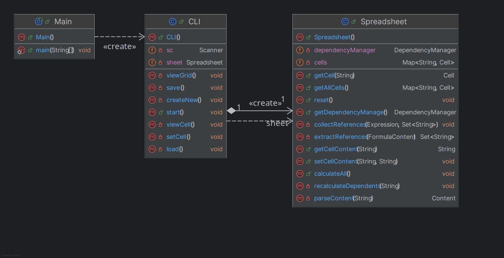
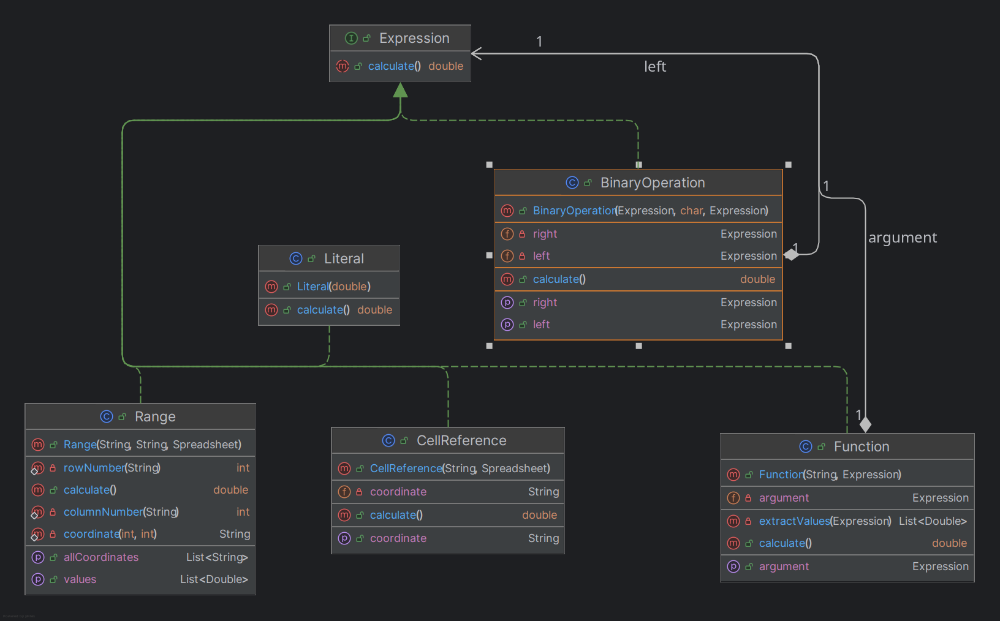
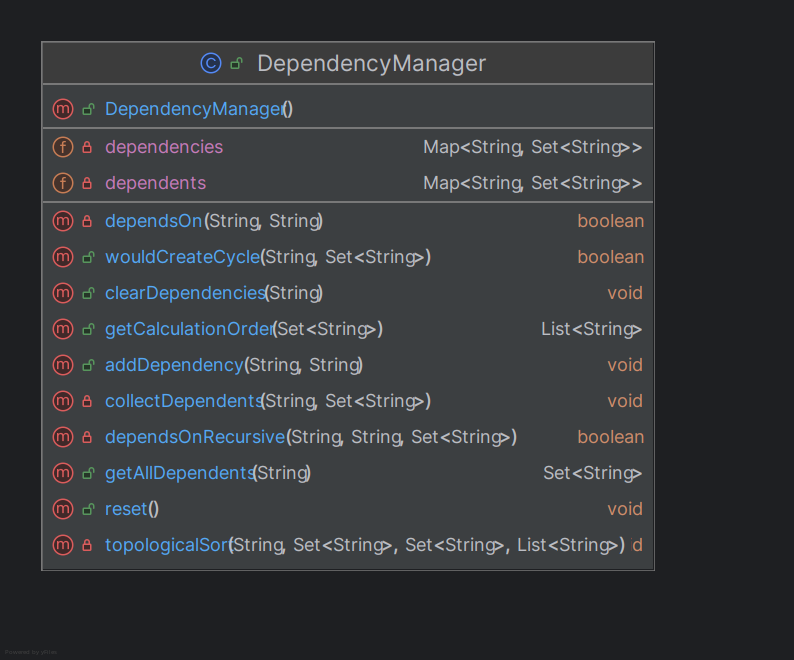
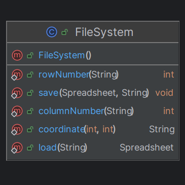

# Excel-CLI Project Report

## Project Implementation Documentation

**Course:** Software Design
**Project:** Command-Line Spreadsheet Application
**Language:** Java

---

## Table of Contents

1. [Project Overview](#1-project-overview)
2. [Architecture](#2-architecture)
3. [Class Diagrams](#3-class-diagrams)
4. [Design Patterns](#4-design-patterns)
5. [Feature Implementation](#5-feature-implementation)
6. [File Format](#6-file-format)

---

## 1. Project Overview

Excel-CLI is a command-line spreadsheet application built in Java. It provides core spreadsheet functionality including:

- **Cell Management**: Create, read, and update cells with coordinates (A1, B2, AA10, etc.)
- **Multiple Content Types**: Support for text, numeric values, and formulas
- **Formula Engine**: Parse and evaluate mathematical expressions with cell references
- **Built-in Functions**: SUMA, MIN, MAX, PROMEDIO (average)
- **Dependency Tracking**: Automatic recalculation when referenced cells change
- **Circular Dependency Detection**: Prevents infinite loops in formulas
- **File Persistence**: Save/load spreadsheets using S2V (Semicolon Separated Values) format

---

## 2. Architecture

The application follows a layered architecture with clear separation of concerns:

```
┌─────────────────────────────────────────────────────────┐
│                    Presentation Layer                   │
│                        (CLI.java)                       │
├─────────────────────────────────────────────────────────┤
│                    Business Logic Layer                 │
│  ┌─────────────┐  ┌─────────────┐  ┌─────────────────┐  │
│  │ Spreadsheet │  │   Formula   │  │   Dependency    │  │
│  │             │  │   Engine    │  │    Manager      │  │
│  └─────────────┘  └─────────────┘  └─────────────────┘  │
├─────────────────────────────────────────────────────────┤
│                      Domain Layer                       │
│  ┌──────┐  ┌─────────┐  ┌────────────┐  ┌───────────┐   │
│  │ Cell │  │ Content │  │ Expression │  │   Range   │   │
│  └──────┘  └─────────┘  └────────────┘  └───────────┘   │
├─────────────────────────────────────────────────────────┤
│                   Persistence Layer                     │
│                    (FileSystem.java)                    │
└─────────────────────────────────────────────────────────┘
```

### Component Responsibilities

| Component | Responsibility |
|-----------|----------------|
| **CLI** | User interface, menu handling, input/output |
| **Spreadsheet** | Central data structure, cell management, content parsing |
| **Cell** | Container for coordinate and content |
| **Content** | Abstract base for different content types |
| **FormulaEngine** | Recursive descent parser for formulas |
| **DependencyManager** | Track cell dependencies, detect cycles |
| **FileSystem** | S2V file format read/write operations |

---

## 3. Class Diagrams

### 3.1 Overall System Class Diagram



### 3.2 Content Type Hierarchy (Strategy Pattern)


### 3.3 Expression Hierarchy (Composite Pattern)



### 3.4 Dependency Management



### 3.5 File System



## 4. Design Patterns

### 4.1 Strategy Pattern (Content Types)

**Purpose:** Allow different content types (text, numeric, formula) to be handled uniformly.

**Implementation:**
- `Content` is the abstract strategy interface
- `TextContent`, `NumericContent`, `FormulaContent` are concrete strategies
- `Cell` holds a reference to `Content` and delegates `getValue()` calls

**Benefits:**
- Easy to add new content types without modifying existing code
- Uniform interface for all content types
- Encapsulates content-specific behavior

```java
// Strategy interface
public abstract class Content {
    public abstract Object getValue();
    public abstract String getRawContent();
}

// Concrete strategies
public class NumericContent extends Content { ... }
public class TextContent extends Content { ... }
public class FormulaContent extends Content { ... }
```

### 4.2 Composite Pattern (Expression Tree)

**Purpose:** Represent formulas as a tree structure where complex expressions are composed of simpler ones.

**Implementation:**
- `Expression` interface defines `calculate()` method
- `Literal` represents leaf nodes (numbers)
- `CellReference` represents leaf nodes (cell values)
- `BinaryOperation` represents composite nodes (operations with two operands)
- `Function` represents composite nodes (functions with arguments)
- `Range` represents a collection of cells

**Benefits:**
- Recursive evaluation of complex formulas
- Easy to extend with new operators or functions
- Clean separation between parsing and evaluation

```java
// Component interface
public interface Expression {
    double calculate();
}

// Leaf nodes
public class Literal implements Expression { ... }
public class CellReference implements Expression { ... }

// Composite nodes
public class BinaryOperation implements Expression {
    private Expression left;
    private Expression right;
    private char operator;
}
```

### 4.3 Observer Pattern (Dependency Tracking)

**Purpose:** Automatically recalculate dependent cells when a cell value changes.

**Implementation:**
- `DependencyManager` maintains a directed graph of dependencies
- When a cell changes, `getAllDependents()` finds all affected cells
- `getCalculationOrder()` uses topological sort for correct recalculation order

**Benefits:**
- Automatic propagation of changes
- Efficient recalculation (only affected cells)
- Cycle detection prevents infinite loops

### 4.4 Interpreter Pattern (Formula Parsing)

**Purpose:** Parse and evaluate formula expressions from string input.

**Implementation:**
- `FormulaEngine` implements a recursive descent parser
- Grammar rules map to parsing methods:
  - `parseExpression()` → addition/subtraction
  - `parseTerm()` → multiplication/division
  - `parseFactor()` → numbers, cells, functions, parentheses

**Grammar:**
```
Expression → Term (('+' | '-') Term)*
Term       → Factor (('*' | '/') Factor)*
Factor     → Number | CellRef | Function | '(' Expression ')' | Range
CellRef    → Letter+ Digit+
Range      → CellRef ':' CellRef
Function   → FunctionName '(' Argument ')'
```

### 4.5 Lazy Initialization (Cell Creation)

**Purpose:** Create cells only when needed to save memory.

**Implementation:**
```java
public Cell getCell(String coord) {
    return cells.computeIfAbsent(coord.toUpperCase(), Cell::new);
}
```

---

## 5. Feature Implementation

### 5.1 Supported Functions

| Function | Description | Example |
|----------|-------------|---------|
| SUMA | Sum of values in range | `=SUMA(A1:A10)` |
| MIN | Minimum value in range | `=MIN(B1:B5)` |
| MAX | Maximum value in range | `=MAX(C1:C5)` |
| PROMEDIO | Average of values in range | `=PROMEDIO(A1:D1)` |

### 5.2 Supported Operators

| Operator | Description | Precedence |
|----------|-------------|------------|
| + | Addition | Low |
| - | Subtraction | Low |
| * | Multiplication | High |
| / | Division | High |
| () | Parentheses | Highest |

### 5.3 Cell Reference Format

- Single column: `A1`, `B2`, `Z99`
- Multi-column: `AA1`, `AB10`, `ZZ100`
- Ranges: `A1:B10`, `C3:F8`

### 5.4 CLI Menu Options

1. **Set cell** - Enter cell coordinate and content
2. **View cell** - Display raw content and evaluated value
3. **View spreadsheet grid** - Display all cells in a grid format
4. **Save spreadsheet** - Save to S2V file
5. **Load spreadsheet** - Load from S2V file
6. **Create new spreadsheet** - Clear all data
7. **Exit** - Close application

---

## 6. File Format

### S2V (Semicolon Separated Values)

The application uses a custom file format where:
- Semicolons (`;`) separate cells in each row
- Newlines separate rows
- Empty cells are represented as empty strings between delimiters
- Formulas are stored as raw text (starting with `=`)

**Example:**
```
10;20;=A1+B1
Hello;World;
=SUMA(A1:B1);;100
```

This represents:
```
    A           B           C
1   10          20          =A1+B1 (evaluates to 30)
2   Hello       World       (empty)
3   =SUMA(A1:B1) (empty)    100
```

---


### Example Session

```
=== Excel-CLI ===
1. Set cell
2. View cell
3. View spreadsheet grid
4. Save spreadsheet
5. Load spreadsheet
6. Create new spreadsheet
7. Exit
Choose: 1
Cell (e.g. A1): A1
Content (text, number, or formula starting with =): 10
Cell A1 set successfully
Evaluated value: 10.0

Choose: 1
Cell (e.g. A1): B1
Content (text, number, or formula starting with =): 20
Cell B1 set successfully
Evaluated value: 20.0

Choose: 1
Cell (e.g. A1): C1
Content (text, number, or formula starting with =): =A1+B1
Cell C1 set successfully
Evaluated value: 30.0

Choose: 3
=== Spreadsheet Grid ===
     A               B               C
     --------------- --------------- ---------------
1   |10.0            20.0            30.0
```


